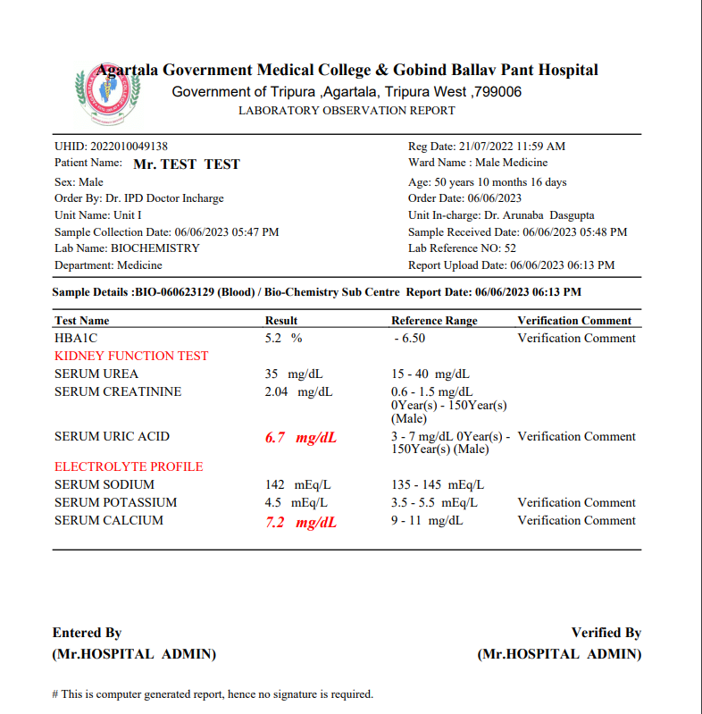
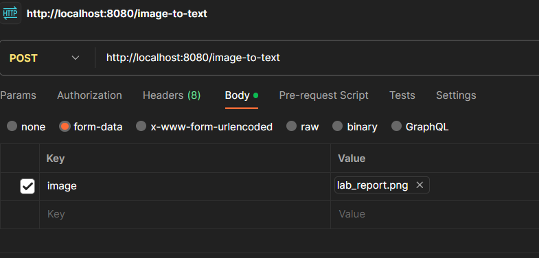

# Lab Report OCR API

The Lab Report OCR API is a  web service that allows you to extract text from images and convert it into JSON or plain text formats. This API utilizes the Tesseract OCR engine to perform optical character recognition on the provided image file.. It provides two endpoints: `image-to-json` and `image-to-text`. These endpoints accept an image file as input and return the extracted text in either JSON or plain text format.

## Endpoints

### 1. Convert Image to JSON

This endpoint converts the extracted text from lab report image to JSON format.

**URL:** `/image-to-json`
**Method:** POST

#### Request

The API expects a multipart/form-data request with the following parameter:

- `image`: The lab report image file.

**SAMPLE IMAGE:**

<center>

</center>

#### Response

##### Success Response

- **Status Code:** 200 OK
- **Content Type:** application/json
- **Body:** JSON data representing the extracted lab report information.

```json
{
    "": "1",
    "Age: ": "50 years 10 months 16 days",
    "Lab Reference NO: ": "52",
    "HBAIC ": "52 % -6.50 Verification Comment",
    "SERUM CALCIUM ": "7.2 mg/dL 9-11 mg/dL Verification Comment",
    "‘Sample Reccived Date: ": "06/06/2023 05:48 PM",
    "‘Sample Collection Date: ": "06/06/2023 05:47 PM",
    "Government of Tripura Agartala, Tripura West ;": "799006",
    "'UHID: ": "2022010049138",
    "SERUM POTASSIUM ": "45 mEq/L 35-5.5 mEqL Verification Comment",
    "SERUM SODIUM ": "142 mEq/L 135 - 145 mEq/L",
    "SERUM UREA ": "35 mg/dL 15-40 mg/dL",
    "nvms) - ": "150Year(s",
    "SERUM CREATININE ": "204 mg/dL 06",
    "SERUM URIC ACID ": "6.7 mg/dL 0Year(s) - Verification Comment",
    "Department: Medicine: Report Upload Date: ": "06/06/2023 06:13 PM",
    "Order Date: ": "06/06/2023",
    "Reg Date: ": "21/07/2022 11:59 AM"
}
```

##### Error Response

- **Status Code:** 400 Bad Request
- **Body:** `Error message indicating that the image file is required.`

- **Status Code:** 500 Internal Server Error

- **Body:** `Error message indicating an issue with processing the image file.`


### 2. Convert Image to Text

This endpoint converts the lab report image to plain text format.

**URL:** `/image-to-text`<center>

</center>
**Method:** POST


#### Request

The API expects a multipart/form-data request with the following parameter:

- `image`: The lab report image file.

<center>

</center>

#### Response

##### Success Response

- **Status Code:** 200 OK
- **Content Type:** text/plain
- **Body:** Plain text data representing the extracted lab report information.

```text
Government Medical College & Gobind Ballav Pant Hospital

Government of Tripura Agartala, Tripura West ;799006
LABORATORY OBSERVATION REPORT

'UHID: 2022010049138
Patient Name: - Mr, TEST TEST

Sex: Male.

Order By: Dr. IPD Doctor Incharge

Unit Name: Unit I

‘Sample Collection Date: 06/06/2023 05:47 PM.
Lab Name: BIOCHEMISTRY

Reg Date: 21/07/2022 11:59 AM
‘Ward Name : Male Medicine

Age: 50 years 10 months 16 days

Order Date: 06/06/2023

Unit In-charge: Dr. Arunaba Dasgupta
‘Sample Reccived Date: 06/06/2023 05:48 PM
Lab Reference NO: 52

Department: Medicine: Report Upload Date: 06/06/2023 06:13 PM.
aple Detai y N =
Test Name Result i
HBAIC 52 % -6.50 Verification Comment
KIDNEY FUNCTION TEST
SERUM UREA 35 mg/dL 15-40 mg/dL.
SERUM CREATININE 204 mg/dL 06-
nvms) - 150Year(s)
1
SERUM URIC ACID 6.7 mg/dL 0Year(s) - Verification Comment
lSDYul(s) (Male)
ELECTROLYTE PROFILE
SERUM SODIUM 142 mEq/L 135 - 145 mEq/L
SERUM POTASSIUM 45 mEq/L 35-5.5 mEqL Verification Comment
SERUM CALCIUM 7.2 mg/dL 9-11 mg/dL Verification Comment
Entered By Verified By

(Mr.HOSPITAL ADMIN)

(Mr.HOSPITAL ADMIN)

```

##### Error Response

- **Status Code:** 400 Bad Request
- **Body:** `Error message indicating that the image file is required.`

- **Status Code:** 500 Internal Server Error
- **Body:** `Error message indicating an issue with processing the image file.`

## Prerequisites

To run the Lab Report OCR API, make sure you have the following components installed and configured:

- Java Development Kit (JDK) 8 or later
- Apache Maven
- Tesseract OCR engine
- Tesseract language data files

## Build and Run

To build and run the Lab Report OCR API, follow these steps:

1. Clone the repository from GitHub:
   ```
   git clone https://github.com/Tushar2690/Report_OCR.git
   ```
2. Navigate to the project directory:
   ```
   cd Report_OCR
   ```
3. Build the project using Maven:
   ```
   mvn clean package
   ```
4. Run the application:
   ```
   java -jar target/image-ocr-api.jar
   ```

The API will be accessible at `http://localhost:8080`.

## Configuration

Before running the Lab Report OCR API, ensure that the Tesseract OCR engine is properly configured with the required language data files. Update the Tesseract configuration in the `FileController` class based on your specific setup.

## Dependencies

The Lab Report OCR API uses the following dependencies:

- Spring Boot Starter Web: Provides the necessary components for building RESTful APIs.
- Tess4J: A Java wrapper for the Tesseract OCR engine.

- JSON (org.json):This dependency allows you to work with JSON data in your application.

## Usage

To use the Lab Report OCR API, follow these steps:

1. Make sure the API is running locally or deployed to a server.
2. Choose one of the endpoints (`image-to-json` or `image-to-text`) based on your desired output format.
3. Send a POST request to the chosen endpoint with the lab report image file attached.
4. The API will process the image using Tesseract OCR and extract the text.
5. The extracted text will be returned in the specified format (JSON or plain text).
6. Handle the API response

 in your application as needed.

## OCR TRAIN DATA: Best and Combined

Tesseract OCR provides two main train data: **best** and **combined**. These modes offer different OCR algorithms and models, resulting in variations in accuracy and performance.

- <u>**Best**</u>: The "best" mode (OCR engine mode 2) in Tesseract OCR uses the latest LSTM (Long Short-Term Memory) models, which are deep learning models capable of achieving high accuracy for OCR tasks. This mode is recommended for most modern OCR applications as it provides improved results in terms of recognition accuracy.

- **Combined**: The "combined" mode (OCR engine mode 1) in Tesseract OCR combines the LSTM models with the legacy OCR models, offering a balance between accuracy and speed. It uses a combination of both models to achieve reasonable accuracy while maintaining faster processing times compared to the "best" mode. This mode can be suitable for scenarios where a good balance between accuracy and speed is required.

The choice of engine mode depends on the specific requirements of your application. If accuracy is the top priority and you have sufficient computational resources, the "best" mode is recommended. If you need a balance between accuracy and speed, the "combined" mode can be a suitable choice.


## Conclusion : 
The Lab Report OCR API simplifies the extraction of text from lab report images. By providing a straightforward interface and leveraging Tesseract OCR, it streamlines the process of converting lab reports into JSON or plain text formats. The API can be easily integrated into existing systems or used as a standalone service to automate data extraction from lab reports.
